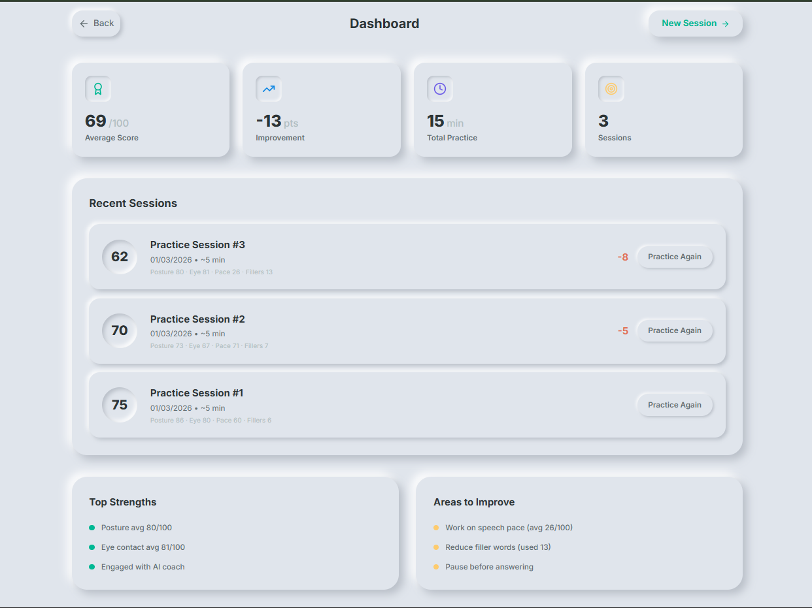

<div align="center">


# 🎯 AceView — AI Interview Coach

**Real-time body language & speech analysis powered by Vision Agents, Deepgram, ElevenLabs, and Gemini AI.**  
Practice interviews with an AI coach that *sees* you, *hears* you, and gives you instant, personalized feedback.

[](https://nextjs.org/)
[](https://fastapi.tiangolo.com/)
[](https://getstream.io/)
[](https://docs.ultralytics.com/)
[](https://deepgram.com/)
[](https://ai.google.dev/)
[](LICENSE)

[](https://aceview-murex.vercel.app)

[🚀 Start Practising](#-quick-start) · [📖 Features](#-features) · [🏗️ Architecture](#%EF%B8%8F-architecture) · [🎬 Demo](#-demo)

</div>

---

## � What is AceView?

AceView is an **open-source AI interview coaching platform** that joins your video call as a co-participant, conducts a real interview, and provides live feedback on six performance axes — all in real time.

> *"It's like having a senior interviewer and a performance coach in the same room, watching every move."*

|  | What AceView tracks |
|---|---|
| 👁️ | **Eye Contact** — Are you looking at the camera? |
| 🧍 | **Posture** — Are your shoulders straight and squared? |
| 💬 | **Filler Words** — How many "um", "like", "you know" did you say? |
| 🎙️ | **Speech Pace** — Are you speaking at 130 WPM (ideal interview pace)? |
| 🧠 | **AI Nudges** — Real-time coaching tips when performance dips |
| 📊 | **Report Card** — Gemini-generated grade + strengths + action plan |

---

## ✨ Features

### 🔴 Live Session
- **AI Video Coach** — ElevenLabs-voiced AI joins the call, asks tailored interview questions, and listens to your answers
- **Confidence Ring** — Video border pulses green → yellow → red with your confidence level. Faster pulse = lower confidence
- **Real-time Metrics** — Posture, eye contact, speech pace, and filler words update every second on the right panel
- **Live Transcript** — See your words appear as you speak, with filler words highlighted in real time

### 🤖 AI Nudges (Invisible Coaching)
Minimalist pop-up tips appear mid-session without interrupting your flow:
- *"Sit up straight and square your shoulders"* — when posture drops below 70
- *"Look directly at your camera"* — when eye contact drops below 65
- *"You've used 5 filler words — try pausing instead"* — at 5/10/15 filler thresholds
- *"Make sure your face is visible on camera"* — when face disappears from frame
- Multiple nudges can fire simultaneously with individual 10-second cooldowns

### 📊 Session Report Card
After every session, Gemini generates a personalised A–D graded report:
- **Overall Score** averaged across the full session (not just the last moment)
- **Strengths** — only metrics scoring ≥ 75 are listed as strengths (honest feedback)
- **Areas to Improve** — specific, actionable coaching points
- **Tip of the Day** — one concrete thing to work on next time
- **Download as PDF** — one-click clean PDF export

### 📈 Dashboard
- Session history with per-session posture / eye / pace / filler breakdowns
- Improvement tracking across sessions
- Aggregated strengths and improvement areas from your latest session

---

## 🏗️ Architecture

```
┌─────────────────────────────────────────────────────────────────┐
│                        FRONTEND (Next.js)                        │
│  VideoPreview ─── StreamProvider ─── MetricsDisplay             │
│      │                  │                   │                    │
│  Stream WebRTC      Custom Events      Zustand Store            │
└──────────────────────────┬──────────────────────────────────────┘
                           │ HTTP + WebRTC
┌──────────────────────────▼──────────────────────────────────────┐
│                        BACKEND (FastAPI)                         │
│                                                                  │
│  /api/start-session ──► AgentLauncher                           │
│                              │                                   │
│                    ┌─────────▼──────────┐                       │
│                    │   Vision Agent      │                       │
│                    │  (Vision Agents SDK)│                       │
│                    └──┬──────┬──────┬───┘                       │
│                       │      │      │                            │
│              Deepgram  │  YOLO│  ElevenLabs                     │
│              STT       │  Pose│  TTS                            │
│              (speech)  │  (video)  (voice)                      │
│                        │                                         │
│              AceViewVisionProcessor                              │
│              ├── _calculate_posture()    ← YOLOv11 keypoints    │
│              ├── _calculate_eye_contact() ← ear asymmetry       │
│              └── _send_nudge_if_needed() ← threshold checks     │
│                                                                  │
│  /api/session/summary ──► Gemini 2.0 Flash (via OpenRouter)    │
└─────────────────────────────────────────────────────────────────┘
```

### Key Design Decisions

| Decision | Rationale |
|---|---|
| **YOLO at 1 FPS** | Prevents audio pipeline starvation — 3 FPS caused AudioQueue overflow |
| **Ear asymmetry for eye contact** | YOLO can't track eyeballs, but reliably detects which ear is visible (head rotation proxy) |
| **Session averages on report card** | Snapshot at session-end is unfair — 2 seconds of slouching shouldn't tank a 10-minute session |
| **Subprocess isolation removed** | AgentLauncher is stable; subprocess approach caused WebSocket timing issues |
| **Filler words via regex** | Deepgram SDK v2 doesn't support `filler_words` param — regex on transcript is equally accurate |

---

## 🛠️ Tech Stack

| Layer | Technology |
|---|---|
| **Frontend** | Next.js 15, React, Zustand, Tailwind CSS |
| **Video SDK** | Stream Video React SDK (`@stream-io/video-react-sdk`) |
| **Backend** | FastAPI, Uvicorn, Python 3.12 |
| **Agent Framework** | Vision Agents SDK (GetStream) |
| **Pose Detection** | YOLOv11 Pose (`yolov11n-pose.pt`) |
| **Speech-to-Text** | Deepgram Nova-2 (real-time streaming) |
| **Text-to-Speech** | ElevenLabs (Adam voice) |
| **LLM** | Gemini 2.0 Flash via OpenRouter |
| **Package Manager** | `uv` (Python), `npm` (Node) |

---

## 🚀 Quick Start

### Prerequisites
- Python 3.12+
- Node.js 18+
- [`uv`](https://docs.astral.sh/uv/getting-started/installation/) package manager
- Git

### 1. Clone Both Repos (as sibling folders)

The backend depends on Vision Agents as a local editable install. Both repos **must** sit in the same parent directory.

```bash
# From your chosen parent directory (e.g. Desktop)
git clone https://github.com/SKfaizan-786/aceview.git
git clone https://github.com/GetStream/Vision-Agents.git
```

Your folder structure must be:
```
<parent>/
  AceView/          ← this repo
  Vision-Agents/    ← GetStream SDK (sibling)
```

### 2. Apply SDK Patches

Two files in the Vision Agents SDK must be patched. Both are in the `patches/` folder.

**Patch 1 — SFU routing fix** (fixes `participant not found` crash):
```powershell
cd AceView
Copy-Item "patches\stream_edge_transport.py" "..\Vision-Agents\plugins\getstream\vision_agents\plugins\getstream\stream_edge_transport.py"
```

**Patch 2 — Deepgram STT fix** (fixes `TypeError: unexpected keyword argument 'filler_words'`):
```powershell
Copy-Item "patches\deepgram_stt.py" "..\Vision-Agents\plugins\deepgram\vision_agents\plugins\deepgram\deepgram_stt.py"
```

> ⚠️ **Both patches are required.** Skipping Patch 2 causes a silent crash — the AI joins but immediately disconnects.

### 3. Configure Environment Variables

Create `backend/.env`:
```env
STREAM_API_KEY=your_stream_api_key
STREAM_SECRET=your_stream_api_secret
OPENROUTER_API_KEY=your_openrouter_key
ELEVENLABS_API_KEY=your_elevenlabs_key
DEEPGRAM_API_KEY=your_deepgram_key
```

> Get API keys from the project owner. Never commit `.env`.

### 4. Install Dependencies

```bash
# Backend
cd AceView/backend
uv sync

# Frontend
cd AceView/frontend
npm install
```

### 5. Run

Open two terminals:

```bash
# Terminal 1 — Backend (port 8000)
cd AceView/backend
uv run python main.py
# Wait for: INFO: Application startup complete.

# Terminal 2 — Frontend (port 3000)
cd AceView/frontend
npm run dev
```

Open [http://localhost:3000](http://localhost:3000) 🎉

---

## 🎬 Demo

[](https://youtu.be/PQ_nZ8KGVYQ)

▶️ **[Watch Full Demo on YouTube](https://youtu.be/PQ_nZ8KGVYQ)**

---

## 📸 Screenshots

### 🟢 Live Session — HIGH Confidence (Great Posture & Eye Contact)


### 👁️ Bad Eye Contact — AI Nudge Firing


### 💬 Filler Words Highlighted Live in Transcript


### 📊 AI Report Card — Grade & Personalised Feedback


### 📈 Dashboard — Session History & Progress


---

## 📁 Project Structure

```
AceView/
├── backend/
│   ├── agents/
│   │   ├── interview_agent.py      # Agent setup, STT handlers, WPM tracking
│   │   └── vision_processor.py     # YOLO pose analysis, nudge logic
│   ├── main.py                     # FastAPI app, session endpoints
│   └── yolo26n-pose.pt             # YOLOv11 pose model
│
├── frontend/
│   ├── app/
│   │   ├── page.tsx                # Landing page
│   │   ├── interview/page.tsx      # Main interview page
│   │   └── dashboard/page.tsx      # Session history dashboard
│   ├── components/
│   │   ├── Interview/
│   │   │   ├── VideoPreview.tsx    # Confidence ring + YOLO video
│   │   │   ├── MetricsDisplay.tsx  # Live score bars
│   │   │   ├── LiveTranscript.tsx  # Real-time transcript
│   │   │   └── AIPromptOverlay.tsx # Nudge pop-ups
│   │   └── StreamProvider.tsx      # WebRTC + event bridge
│   └── store/
│       └── interviewStore.ts       # Zustand store + session averages
│
└── patches/
    ├── stream_edge_transport.py    # SFU routing fix
    ├── deepgram_stt.py             # Deepgram SDK compatibility fix
    └── README.md                   # Patch documentation
```

---

## 🐛 Troubleshooting

| Issue | Fix |
|---|---|
| `Failed to fetch` on Start Session | Stale backend process on port 8000. Run: `Get-Process python* \| Stop-Process -Force` then restart backend |
| `uv sync` fails with path errors | Make sure `Vision-Agents/` is a sibling of `AceView/`, not inside it |
| AI agent joins but immediately leaves | Deepgram patch not applied — run Patch 2 from Step 2 |
| Camera not showing | Allow camera/microphone permissions in browser when prompted |
| `participant not found` SFU error | Stream edge transport patch not applied — run Patch 1 from Step 2 |

---

## 🤝 Contributing

1. Fork the repo
2. Create a feature branch (`git checkout -b feat/amazing-feature`)
3. Commit your changes (`git commit -m 'feat: add amazing feature'`)
4. Push to the branch (`git push origin feat/amazing-feature`)
5. Open a Pull Request

---

## 📄 License

MIT License — see [LICENSE](LICENSE) for details.

---

<div align="center">

Built with ❤️ using **Vision Agents** · **Deepgram** · **ElevenLabs** · **Gemini AI** · **Stream Video**

⭐ **Star this repo if AceView helped you ace your interviews!**

</div>
